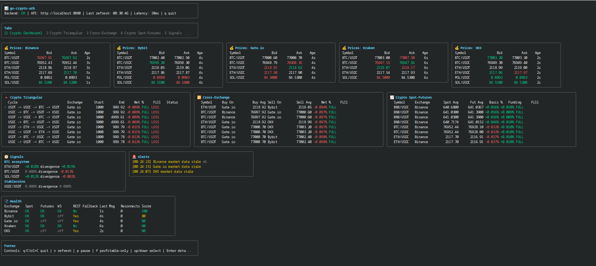
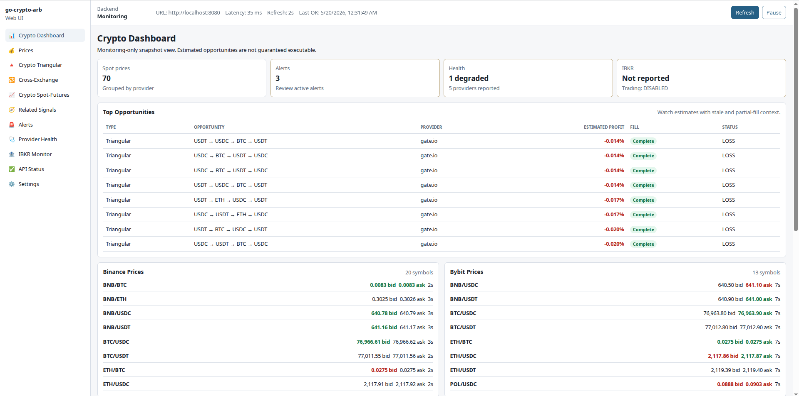

# go-crypto-arb

Version: `v2.1.0`
Project generated by LLM: Codex GPT-5.5 Extra High

`go-crypto-arb` is a monitoring-only arbitrage detection system written in Go. It has a backend REST API service and a separate Bubble Tea/Lip Gloss terminal UI. The TUI only talks to the backend API; it never connects directly to external exchanges or IBKR.

No real trading, order execution, order placement, buy/sell automation, or IBKR orders are implemented in this version.

## v2.1 Overview

- Normalized order book depth collection for Binance, Kraken, and spot public-REST adapters where practical
- Liquidity-aware execution simulation across configured trade sizes
- Depth-aware crypto triangular, cross-exchange, and spot-futures calculations
- Provider model split into crypto exchange providers and broker providers
- IBKR broker market-data provider skeleton with configured instruments and health
- IBKR-only TUI tab for broker instruments, FX triangular monitoring, and futures basis monitoring
- Configurable instrument, tab, and strategy titles
- Optional emoji/icon support with ASCII fallback
- Alert deduplication, cooldowns, repeat thresholds, and severity
- Prometheus metrics endpoint
- Config validation command with IBKR safety checks

## Architecture

- `cmd/api`: backend service and `validate-config` command
- `cmd/tui`: terminal UI client
- `internal/exchange`: crypto exchange interfaces, symbols, platform registry, Binance/Kraken adapters, and shared public-REST adapters
- `internal/broker/ibkr`: IBKR broker market-data adapter skeleton
- `internal/provider`: shared provider interfaces
- `internal/instrument`: instrument universe helpers
- `internal/marketdata`: concurrency-safe latest-state store
- `internal/arbitrage`: execution simulation and strategy calculators
- `internal/alerts`: in-memory alert engine with deduplication and cooldown
- `internal/api`: REST API and metrics endpoints
- `internal/health`: deterministic provider health scoring

Provider model:

```text
Provider
├── CryptoExchangeProvider
│   ├── Binance
│   ├── Kraken
│   ├── OKX
│   ├── Bybit
│   ├── Coinbase
│   ├── Gate.io
│   └── Bitget
└── BrokerProvider
    └── IBKR
```

Supported crypto exchange platforms are OKX, Bybit, Binance, Kraken, Coinbase, Gate.io, and Bitget. Binance and Kraken remain enabled in the sample config. OKX, Bybit, Coinbase, Gate.io, and Bitget are disabled by default and currently use spot public REST market data. IBKR is a broker market-data provider and is kept separate from crypto exchange arbitrage unless a strategy explicitly references it.

## Why Depth Matters

Best bid/ask can be misleading because the top level may not contain enough size. v2.1 simulates fills through configured order book depth:

- Buy simulation consumes asks from lowest ask upward.
- Sell simulation consumes bids from highest bid downward.
- Taker fees are applied to every simulated leg.
- Partial fills are marked as liquidity-limited.
- Slippage is calculated against the best visible price.

Depth simulation improves realism, but it still does not guarantee executable arbitrage.

## Configure

```bash
cp .env.example .env
cp configs/config.example.yaml configs/config.yaml
```

`.env`:

```env
API_KEY=change-me
CONFIG_PATH=./configs/config.yaml
HTTP_ADDR=:8080

IBKR_ENABLED=true
IBKR_HOST=127.0.0.1
IBKR_PORT=7497
IBKR_CLIENT_ID=101
```

Crypto public market data for OKX, Bybit, Binance, Kraken, Coinbase, Gate.io, and Bitget does not require API secrets.

## IBKR Setup

IBKR support is market-data only in v2.1. Configure TWS or IB Gateway to accept local API connections, then set:

```yaml
providers:
  ibkr:
    enabled: true
    type: broker
    market_data_enabled: true
    trading_enabled: false
    crypto_spot_enabled: false
    api_mode: "tws_gateway"
    host: "127.0.0.1"
    port: 7497
    client_id: 101
```

`trading_enabled: false` is the safety guarantee for this version. If it is set to `true`, config validation returns a hard error and no order-placement code path exists.

IBKR instruments live under `instrument_universes`, with custom display names and optional IBKR contract fields:

```yaml
instrument_universes:
  ibkr_futures:
    title: "IBKR Futures"
    providers: ["ibkr"]
    instruments:
      - id: CME_MICRO_BTC
        display_name: "CME Micro Bitcoin Future"
        asset_class: futures
        market_type: futures
        ibkr:
          symbol: "MBT"
          sec_type: "FUT"
          exchange: "CME"
          currency: "USD"
          con_id: null
```

## Strategies

Strategy blocks support provider filters, custom titles, result limits, and depth simulation toggles. IBKR is excluded from crypto triangular arbitrage by default.

Crypto spot vs IBKR futures basis compares configured crypto spot asks to IBKR futures bids. It is basis monitoring, not guaranteed arbitrage.

## Validate Config

```bash
go run ./cmd/api validate-config --config ./configs/config.yaml
```

The command prints `OK`, `WARN`, and `ERROR` lines. It exits non-zero for hard errors such as a missing `API_KEY`, unsupported enabled providers, or `ibkr.trading_enabled: true`.

New exchange platform entries in the default config are disabled until explicitly enabled:

```yaml
providers:
  okx:
    enabled: false
  bybit:
    enabled: false
  coinbase:
    enabled: false
  gateio:
    enabled: false
  bitget:
    enabled: false
```

## Run

Backend:

```bash
go run ./cmd/api
```

TUI:

```bash
go run ./cmd/tui
```

## REST API

All `/api/v1/*` routes require:

```bash
X-API-Key: change-me
```

Examples:

```bash
curl http://localhost:8080/health
curl -H "X-API-Key: change-me" http://localhost:8080/api/v1/prices
curl -H "X-API-Key: change-me" http://localhost:8080/api/v1/order-books
curl -H "X-API-Key: change-me" "http://localhost:8080/api/v1/order-books?provider=binance&symbol=BTC/USDT&market=spot"
curl -H "X-API-Key: change-me" http://localhost:8080/api/v1/providers
curl -H "X-API-Key: change-me" http://localhost:8080/api/v1/providers/health
curl -H "X-API-Key: change-me" http://localhost:8080/api/v1/ibkr/instruments
curl -H "X-API-Key: change-me" http://localhost:8080/api/v1/ibkr/fx-triangular
curl -H "X-API-Key: change-me" http://localhost:8080/api/v1/ibkr/crypto-futures-basis
curl -H "X-API-Key: change-me" http://localhost:8080/api/v1/snapshot
```

## Prometheus

When enabled:

```bash
curl http://localhost:8080/metrics
```

Example metrics:

```text
go_crypto_arb_price_bid{market="spot",provider="binance",symbol="BTC/USDT"} 67210.20
go_crypto_arb_price_ask{market="spot",provider="binance",symbol="BTC/USDT"} 67212.10
go_crypto_arb_price_spread{market="spot",provider="binance",symbol="BTC/USDT"} 1.90
go_crypto_arb_funding_rate{exchange="binance",symbol="BTC/USDT"} 0.0001
go_crypto_arb_order_book_best_bid{exchange="binance",market="spot",provider="binance",symbol="BTC/USDT"} 67210.20
go_crypto_arb_market_active{asset_class="fx",broker="ibkr",display_name="EUR/USD",exchange="ibkr",instrument_id="EUR_USD",market="spot",provider="ibkr",symbol="EUR/USD"} 1
go_crypto_arb_arbitrage_profit_percent{buy_exchange="binance",buy_provider="binance",exchange="",provider="",sell_exchange="kraken",sell_provider="kraken",strategy="Cross-Exchange",symbol="BTC/USDT",type="cross_exchange"} 0.019
go_crypto_arb_arbitrage_trade_size{buy_exchange="binance",buy_provider="binance",exchange="",provider="",sell_exchange="kraken",sell_provider="kraken",strategy="Cross-Exchange",symbol="BTC/USDT",type="cross_exchange"} 1000
go_crypto_arb_related_asset_change_percent{asset="BTC",exchange="binance",group="BTC ecosystem",symbol="BTC/USDT"} 1.1
go_crypto_arb_alert_active{exchange="",severity="warning",status="active",symbol="BTC/USDT",type="cross_exchange_arbitrage"} 1
go_crypto_arb_provider_connected{provider="ibkr"} 0
go_crypto_arb_ws_reconnect_total{provider="kraken"} 2
go_crypto_arb_stale_price_total{provider="kraken"} 4
go_crypto_arb_health_score{provider="ibkr"} 40
```

## Alerts

Alerts are kept in memory. v2.1 supports:

- Deduplication by opportunity/provider key
- Cooldown from `alerts.cooldown`
- Repeat only when value changes by `repeat_if_profit_changes_by_percent`
- Severity: `info`, `warning`, `critical`
- Repeat counts in the API and TUI

Telegram, email, and webhook notifiers are intentionally not implemented in v2.1.

## Health Scoring

Health starts at 100 and subtracts configured penalties:

- stale ticker/order book data: `stale_penalty`
- disconnected WebSocket or IBKR gateway: `disconnected_penalty`
- REST fallback active: `rest_fallback_penalty`
- reconnect count: `reconnect_penalty * reconnects`
- partial feature support and last errors reduce score

Status values: `ok`, `degraded`, `stale`, `disconnected`.

## Screenshots

### TUI



### Web UI



## TUI

Controls:

- `q` or `Ctrl+C`: quit
- `r`: manual refresh
- `p`: pause/resume auto-refresh
- `f`: profitable-only filter
- `up/down`: select row
- `Enter`: open detail panel
- `Esc`: close detail panel
- `?`: help overlay
- `1` through `8`: switch tabs

Tabs:

1. Crypto Dashboard
2. Crypto Triangular
3. Cross-Exchange
4. Crypto Spot-Futures
5. Signals
6. Alerts
7. Health
8. IBKR Monitor

Emoji/icon support is configured with:

```yaml
tui:
  use_emoji: true
  use_ascii_fallback: true
```

Set `use_emoji: false` for ASCII-safe symbols.

## Web UI

A separate React/TypeScript web UI lives in [`web-ui/`](web-ui/). It is an alternative read-only client for the same backend REST API and does not replace the TUI.

```bash
cd web-ui
npm install
npm run generate:api
npm run dev
```

Configure it with `VITE_API_BASE_URL=http://localhost:8080` and `VITE_API_KEY=change-me`, or use the Settings page for local browser configuration. See [`web-ui/README.md`](web-ui/README.md), [`web-ui/API_COMPATIBILITY.md`](web-ui/API_COMPATIBILITY.md), and [`web-ui/ARCHITECTURE.md`](web-ui/ARCHITECTURE.md).

## Docker

```bash
cp .env.example .env
cp configs/config.example.yaml configs/config.yaml
docker compose -f docker-compose.example.yml up --build
```

## systemd

```bash
go build -o /usr/local/bin/go-crypto-arb-api ./cmd/api
go build -o /usr/local/bin/go-crypto-arb-tui ./cmd/tui
sudo cp deployments/go-crypto-arb-api.service /etc/systemd/system/
sudo systemctl daemon-reload
sudo systemctl enable --now go-crypto-arb-api
```

## Current Limitations

- Still monitoring-only
- No real trading
- No order execution
- No private exchange account balances unless implemented later
- No withdrawal/deposit fee modeling
- No transfer-time modeling
- No full latency/race-condition protection
- No guaranteed executable arbitrage
- Order book simulation improves realism but still does not guarantee execution
- IBKR support is market-data only
- IBKR crypto spot is disabled unless explicitly enabled
- IBKR futures basis monitoring is not guaranteed arbitrage
- OKX, Bybit, Coinbase, Gate.io, and Bitget are spot public-REST adapters in this version; futures/funding/WebSocket support is not implemented for those adapters yet
- Kraken futures support remains partial

## Roadmap

v2.2:

- Telegram/webhook/email notifiers
- Better Prometheus metrics
- More TUI filters

v2.3:

- Historical opportunity charts backed by Prometheus
- More exchange adapters

v2.4:

- Backtesting engine
- Strategy replay from historical data

v3.0:

- Optional paper trading module
- Optional real trading execution module
- Risk management engine
- Position tracking

## Contact

Denys Medvid <denys@medvid.cc>

## License

This project is licensed under the GNU General Public License v3.0. See [LICENSE](LICENSE).
