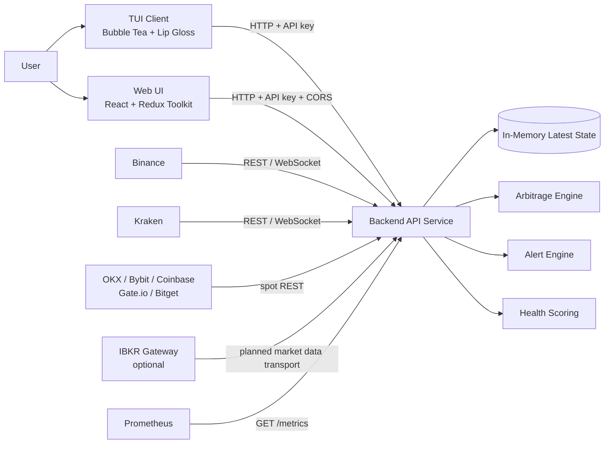

# Architecture

`go-crypto-arb` is a monitoring-only arbitrage detection system written in Go. It collects public market data from crypto exchanges and optional broker market-data providers, normalizes that data into internal models, runs estimate-based arbitrage calculations, exposes the latest state through a REST API, and renders that state through separate UI clients: the terminal UI and the browser web UI.

The system intentionally does not trade. It does not place orders, maintain positions, transfer funds, or automate buy/sell actions.

## Runtime Shape

```text
go-crypto-arb
├── Backend API Service
│   ├── Config Loader
│   ├── Provider Construction
│   ├── Market Data Workers
│   ├── In-Memory State Store
│   ├── Arbitrage Engine
│   ├── Alert Engine
│   ├── Health Scoring
│   └── REST API / Metrics
├── TUI Client
│   ├── Backend API Client
│   ├── Dashboard Renderer
│   ├── Tabs
│   ├── Detail Panels
│   └── Icon / Emoji Layer
└── Web UI Client
    ├── Vite / React App
    ├── Redux Store
    ├── RTK Query API Client
    ├── Routed Dashboard Screens
    └── Browser Settings Persistence
```

## High-Level Diagram



See also [system-context.mmd](diagrams/system-context.mmd), [container-diagram.mmd](diagrams/container-diagram.mmd), and [component-diagram.mmd](diagrams/component-diagram.mmd).

## Backend / UI Separation

The backend service is the only process that talks to external providers. The TUI only calls the backend REST API through `internal/tui/client.go`. The web UI only calls the backend REST API through its RTK Query API layer in `web-ui/src/api/arbApi.ts`.

This separation is important because:

- Provider credentials and connection logic stay in one process.
- UI clients remain display clients, not market-data adapters.
- Calculations are performed once in the backend, so multiple clients can observe the same state.
- API key authentication provides a consistent boundary for local and remote UIs.
- Exchange and broker rate limits are not multiplied by UI refreshes.

## Provider-Based Architecture

The project models data sources as providers:

- Crypto exchange providers: OKX, Bybit, Binance, Kraken, Coinbase, Gate.io, and Bitget.
- Broker providers: IBKR.

The current shared provider interfaces live in `internal/provider/provider.go`:

- `MarketDataProvider`
- `CryptoExchangeProvider`
- `BrokerProvider`

The older crypto exchange interface still lives in `internal/exchange/model.go` as `Exchange`. Binance, Kraken, and the public-REST exchange adapters implement that shape directly. IBKR is implemented separately under `internal/broker/ibkr`.

## Crypto Exchanges vs Broker Providers

Crypto exchanges expose spot/futures symbols, order books, tickers, and funding rates in exchange-native formats. Binance and Kraken provide the richest adapters. OKX, Bybit, Coinbase, Gate.io, and Bitget currently normalize public spot REST data into the same models:

- `exchange.Ticker`
- `exchange.OrderBook`
- `exchange.FundingRate`
- `exchange.MarketInfo`
- `exchange.ExchangeHealth`

IBKR is different:

- Instruments are contract-like, not simple crypto pairs.
- Config may include `symbol`, `sec_type`, `exchange`, `currency`, and optional `con_id`.
- IBKR can represent FX, futures, stocks, and ETFs.
- IBKR crypto spot is disabled by default.
- Trading is unsupported and disabled.

## In-Memory State Model

`internal/marketdata.Store` is the central latest-state store. It holds only current snapshots:

- Spot tickers
- Futures tickers
- Order books
- Funding rates
- Market metadata
- Arbitrage results
- Related asset signals
- Alerts
- Exchange/provider health
- IBKR instrument snapshots

There is no historical database in the application. Historical ingestion is expected to happen externally through Prometheus scraping `/metrics`.

## REST API Boundary

The REST API in `internal/api` is the boundary between backend internals and clients. `/api/v1/*` endpoints require `X-API-Key`. `/health` and `/metrics` are public by design.

The TUI consumes `/api/v1/snapshot` and renders the data locally. The web UI consumes `/api/v1/snapshot` plus focused endpoints such as `/api/v1/prices`, `/api/v1/alerts`, `/api/v1/providers/health`, and the strategy endpoints. Neither UI calculates arbitrage or connects to providers.

Browser clients use CORS. Loopback web UI origins are allowed automatically for local development, and deployed origins can be configured with `api.cors_allowed_origins`.

## Monitoring-Only Scope

The project is explicitly monitoring-only. Trading and execution are excluded because:

- Arbitrage estimates can be invalidated by latency, slippage, fees, partial fills, and market movement.
- Real execution requires account state, risk checks, position tracking, order lifecycle management, and failure recovery.
- IBKR and exchange trading APIs have very different safety profiles and permission models.
- Keeping the system read-only makes it safer to run with public data sources.

## Main Runtime Components

| Component | Package | Responsibility |
| --- | --- | --- |
| API binary | `cmd/api` | Loads config/env, starts `internal/app.App`, serves API |
| TUI binary | `cmd/tui` | Loads config/env, starts Bubble Tea model |
| Application orchestrator | `internal/app` | Builds providers, runs provider loops, calculates snapshots |
| API server | `internal/api` | HTTP routes, API key middleware, Prometheus metrics |
| Config loader | `internal/config` | `.env`, YAML config, defaults, validation |
| Crypto adapters | `internal/exchange/binance`, `internal/exchange/kraken`, `internal/exchange/publicrest` | Provider-specific and shared market data adapters |
| Broker adapter | `internal/broker/ibkr` | IBKR configured-instrument and health skeleton |
| State store | `internal/marketdata` | In-memory latest-state repository |
| Arbitrage engine | `internal/arbitrage` | Simulations, strategy calculators, related signals |
| Alerts | `internal/alerts` | Deduplication, cooldown, severity |
| Health | `internal/health` | Deterministic score/status calculation |
| TUI | `internal/tui` | API client, model/update/view, rendering, icons |
| Web UI | `web-ui` | React/Redux browser client, routed screens, RTK Query API cache |

## Planned / Target Architecture

The target architecture includes a fully realized provider manager, richer provider discovery, a real IBKR TWS Gateway market-data transport, and a dedicated metrics package.

## Architecture Gaps

- Provider management is currently embedded in `internal/app.App`, not a separate provider manager package.
- `internal/provider` defines provider interfaces, but crypto adapters still primarily implement `exchange.Exchange`.
- `internal/metrics` is not present; Prometheus text output is implemented in `internal/api/server.go`.
- IBKR is a partial/skeleton provider: configured instruments and health are exposed, but live TWS market-data ingestion is not implemented.
- Config validation can validate local structure and safety flags, but does not perform live market discovery during `validate-config`.
- The web UI is currently served as a separate static/Vite application; the Go backend does not serve its production assets.
