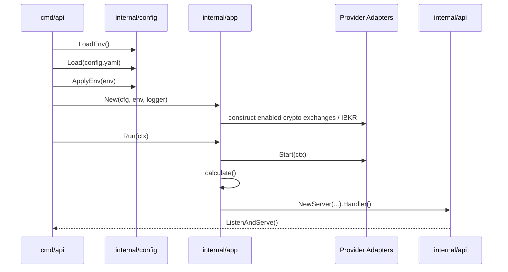
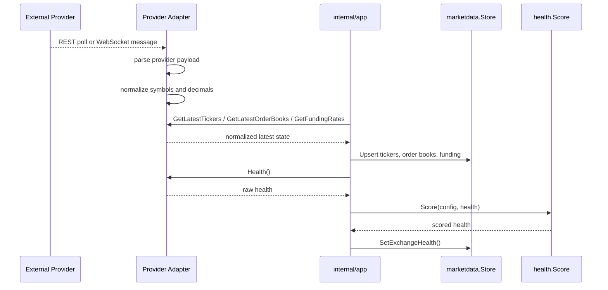
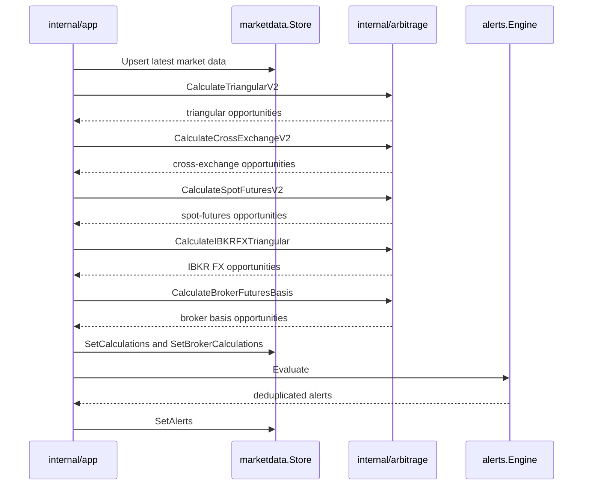
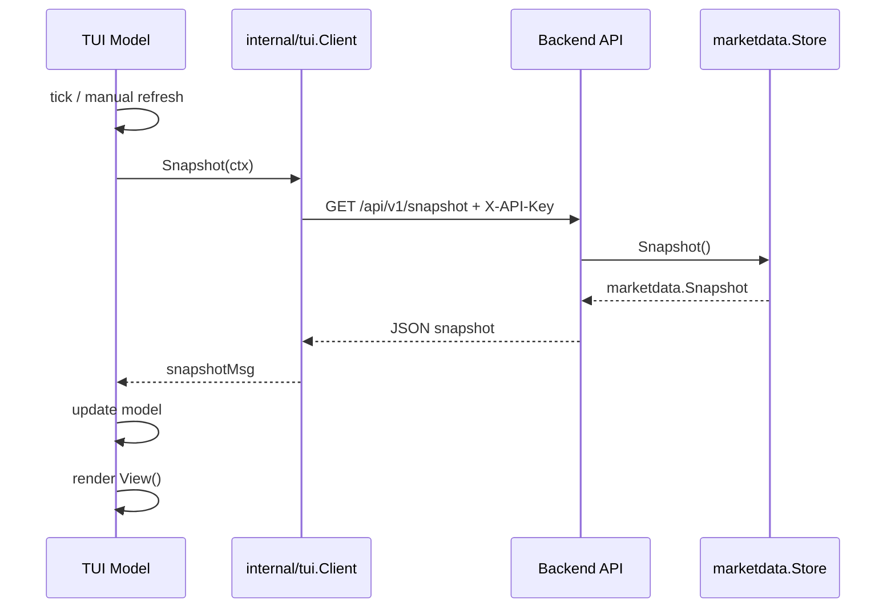
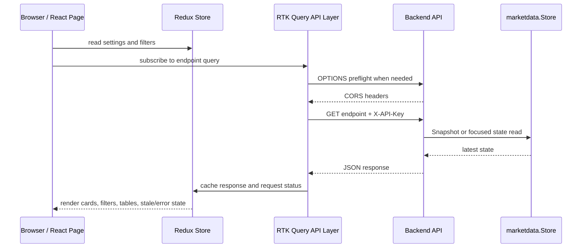

# Data Flow

This document describes how data moves through the running system.

## Summary

```text
Provider REST/WebSocket
  -> Provider Adapter
  -> Normalized Ticker / OrderBook / FundingRate
  -> In-Memory Store
  -> Arbitrage Engine
  -> Alert Engine
  -> REST API
  -> TUI Client / Web UI Client
```

The backend is the producer and owner of state. The TUI and web UI are polling read-only clients.

## Startup Flow

1. `cmd/api/main.go` loads `.env` through `config.LoadEnv`.
2. `cmd/api/main.go` loads YAML config through `config.Load`.
3. Environment overrides are applied with `cfg.ApplyEnv`.
4. `app.New` constructs the in-memory store, enabled crypto exchange adapters, optional IBKR broker adapter, signal engine, and alert engine.
5. `App.Run` starts configured providers.
6. `App.calculate` runs once to seed derived state.
7. A calculation loop starts using `app.refresh_interval`.
8. `internal/api.Server` starts HTTP routes.



## Provider Startup

Binance and Kraken adapters start REST polling loops and WebSocket loops when configured. OKX, Bybit, Coinbase, Gate.io, and Bitget use spot public-REST polling when enabled. Adapters update internal maps protected by mutexes. `internal/app` periodically pulls snapshots out of each adapter.

IBKR currently loads configured instruments and reports health. Live TWS Gateway market-data transport is partial/planned.

## Market Data Ingestion

Provider adapters normalize provider-specific payloads:

- Binance book ticker/depth payloads
- Binance funding rates
- Kraken asset pairs/ticker/depth payloads
- Kraken futures ticker payloads
- OKX, Bybit, Coinbase, Gate.io, and Bitget spot ticker/depth payloads
- IBKR configured instrument metadata

Normalized output types live in `internal/exchange/model.go`:

- `Ticker`
- `OrderBook`
- `FundingRate`
- `MarketInfo`
- `ExchangeHealth`



## Store Update

`internal/app.App.calculate` collects latest provider state and writes it into `internal/marketdata.Store`:

- `UpsertSpotTickers`
- `UpsertFuturesTickers`
- `UpsertFundingRates`
- `UpsertOrderBooks`
- `SetMarkets`
- `SetExchangeHealth`

The store is latest-state only. It does not persist historical changes.

## Arbitrage Calculation

After updating raw market data, `App.calculate` runs:

- `arbitrage.CalculateTriangularV2`
- `arbitrage.CalculateCrossExchangeV2`
- `arbitrage.CalculateSpotFuturesV2`
- `arbitrage.CalculateIBKRFXTriangular`
- `arbitrage.CalculateBrokerFuturesBasis`
- `SignalEngine.Update`

Results are written through:

- `Store.SetCalculations`
- `Store.SetBrokerCalculations`



## Alert Generation

`alerts.Engine.Evaluate` consumes arbitrage results and health snapshots. It applies:

- Threshold checks
- Deduplication keys
- Cooldown
- Repeat-if-value-changed threshold
- Severity selection

The final alert list is written through `Store.SetAlerts`.

## Health Scoring

Each provider adapter exposes a health snapshot. `internal/health.Score` applies deterministic penalties and writes `Score` and `Status`.

Health status is exposed through:

- `/api/v1/exchanges/health`
- `/api/v1/providers/health`
- `/api/v1/snapshot`
- `/metrics`

## REST API Response Flow

API handlers call `store.Snapshot()` and serialize current state. Protected endpoints require `X-API-Key`.

Important snapshot endpoints:

- `/api/v1/snapshot`
- `/metrics`

Browser clients also rely on CORS preflight handling. The backend answers `OPTIONS` requests before API-key middleware, then the actual protected `/api/v1/*` request must include `X-API-Key`.

## TUI Refresh Flow

The TUI model in `internal/tui/model.go` periodically runs `fetchSnapshot`, which calls `Client.Snapshot` in `internal/tui/client.go`. The response is stored in the Bubble Tea model and rendered by `internal/tui/render.go`.



## Web UI Refresh Flow

The web UI in `web-ui/` uses RTK Query polling from React pages. The API layer reads the current API base URL and API key from Redux settings, adds `X-API-Key` to protected `/api/v1/*` requests, and records latency and errors in `apiStatus`.



Manual refresh invalidates RTK Query tags. Pausing refresh sets polling to zero. Failed refetches keep the last successful cache entry visible.

## Additional Diagrams

- [data-flow.mmd](diagrams/data-flow.mmd)
- [sequence-market-data.mmd](diagrams/sequence-market-data.mmd)
- [sequence-arbitrage-calculation.mmd](diagrams/sequence-arbitrage-calculation.mmd)
- [sequence-tui-refresh.mmd](diagrams/sequence-tui-refresh.mmd)
- [sequence-web-ui-refresh.mmd](diagrams/sequence-web-ui-refresh.mmd)

## Architecture Gaps

- Market data updates are pulled from adapters during `calculate`; there is no central event bus or durable queue.
- WebSocket snapshot broadcasting is not a primary implemented client flow.
- Live IBKR market-data ingestion is partial/planned.
- The web UI is polling-based and does not yet use a server-push snapshot stream.
